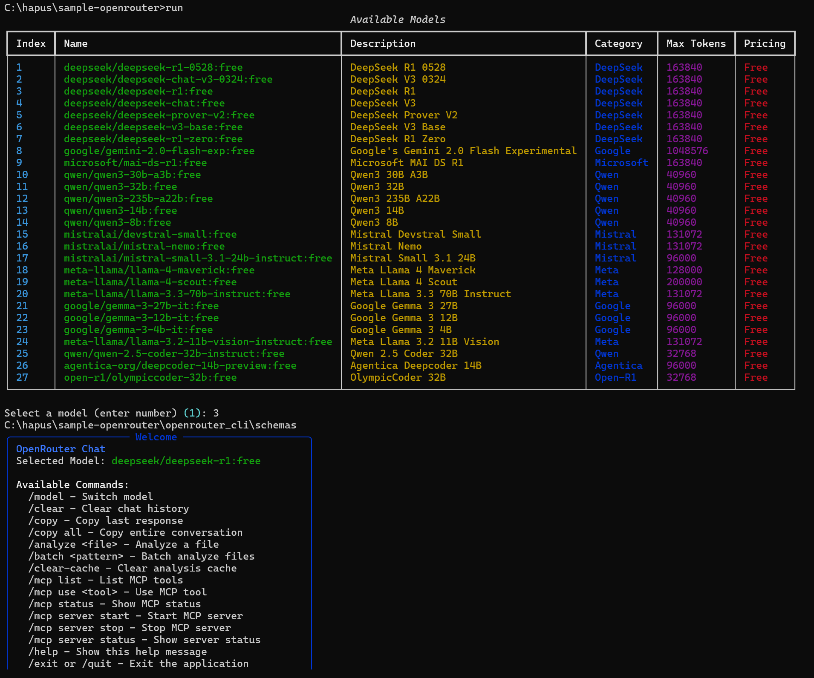

# OpenRouter CLI

OpenRouter API için minimalist komut satırı arayüzü.



## Özellikler

- **Etkileşimli Sohbet**: OpenRouter üzerinden AI modelleriyle sohbet
- **Model Seçimi**: Çoklu model desteği
- **Anahtar Yönetimi**: Birden fazla API anahtarı desteği
- **Otomatik Tamamlama**: Tab ile komut önerileri
- **Renkli Arayüz**: Rich kütüphanesi ile görsel çıktı

## Kurulum

```bash
git clone https://github.com/cenktekin/openrouter-cli.git
cd openrouter-cli
python -m venv venv
source venv/bin/activate
pip install -r requirements.txt
```

### API Anahtarı

```bash
# .env dosyası oluştur
cp .env.example .env
# .env dosyasını düzenle ve API anahtarını ekle
```

## Kullanım

```bash
./run.py
```

**Komutlar:**
- `/help` - Yardım göster
- `/model` - Model değiştir
- `/clear` - Sohbet geçmişini temizle
- `/copy` - Son yanıtı kopyala
- `/copy all` - Tüm sohbeti kopyala
- `/update` - Ücretsiz modelleri güncelle
- `/exit` - Çık

## Bağımlılıklar

- Python 3.7+
- openai
- rich
- pyyaml
- pyperclip
- python-dotenv

## Lisans

MIT License

## Teşekkürler

Bu proje [mexyusef/openrouter-cli](https://github.com/mexyusef/openrouter-cli) reposundan fork edilmiştir.
